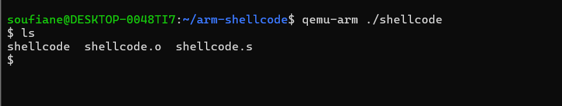
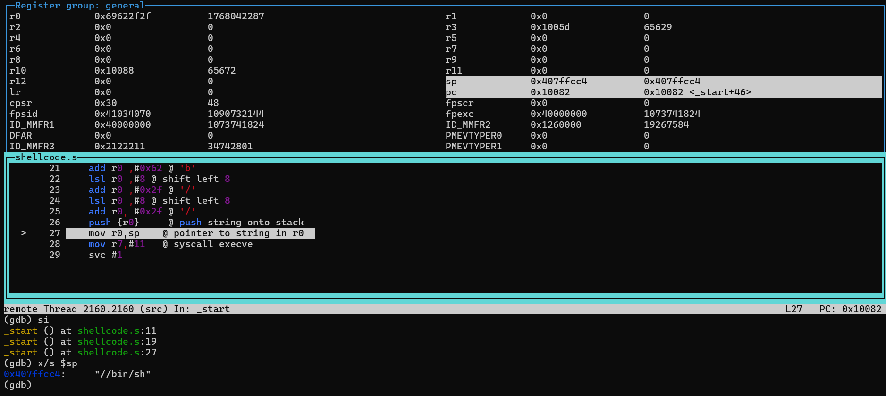

# ARMv7 Thumb Mode Shellcode (Null-Free)

## Overview
This project demonstrates the creation of a position-independent ARMv7 shellcode that executes a local shell (`/bin/sh`) via the `execve` system call. The code is written in Assembly, leveraging **Thumb mode** (16-bit) to minimize binary size and eliminate NULL bytes (`0x00`), ensuring compatibility with string-based exploitation vectors (e.g., `strcpy` buffer overflows).

**Target Architecture:** ARMv7 (32-bit)
**Execution Environment:** QEMU (User Mode Emulation) on Linux

## Technical Details

### Key Constraints & Solutions
* **Null-Byte Avoidance:** Standard ARM instructions (32-bit) often contain `0x00` bytes. This project switches the processor state to **Thumb Mode** (16-bit) using a `BX` instruction to an odd address, allowing for denser instructions that avoid nulls.
* **Stack-Based String Construction:** Instead of storing the payload string (`//bin/sh`) in a data section (which relies on absolute addressing), the string is constructed dynamically on the stack at runtime using immediate values and bitwise shifts (`LSL`). This makes the shellcode **Position Independent Code (PIC)**.
* **Endianness:** The string is pushed in reverse order (Little Endian) to ensure it lays out correctly in memory:
    1.  `sh` (Padded with nulls/alignment)
    2.  `//bi`

### Register Map
* **R0:** Pointer to the filename (`//bin/sh`) on the stack.
* **R1:** Null pointer (Argument array `argv`).
* **R2:** Null pointer (Environment array `envp`).
* **R7:** Syscall Number (`11` for `execve`).

## How to Build & Run

### Prerequisites
* `gcc-arm-linux-gnueabi`
* `qemu-user`

### Compilation
The project includes a Makefile for automated building.

**Option 1: Using Make (Recommended)**
```bash
make

```

**Option 2: Manual Compilation**
```bash
# Assemble
arm-linux-gnueabi-as -o shellcode.o shellcode.s
# Link
arm-linux-gnueabi-ld -o shellcode shellcode.o
```

### Execution
```bash

qemu-arm ./shellcode

```
**Expected Output: You should see a new shell prompt (usually $) indicating the execve call was successful and you have control of a shell instance**

---
## ⚠️ Disclaimer
### Educational Purpose Only

This code is for educational and research purposes only. It is intended to demonstrate low-level architecture concepts, memory management, and system call interfaces.

## Proof of Concept

### 1. Memory Visualization (GDB)
*Verifying stack alignment and register states before syscall execution.*


### 2. Successful Execution
*Running the shellcode in QEMU and popping a shell.*
